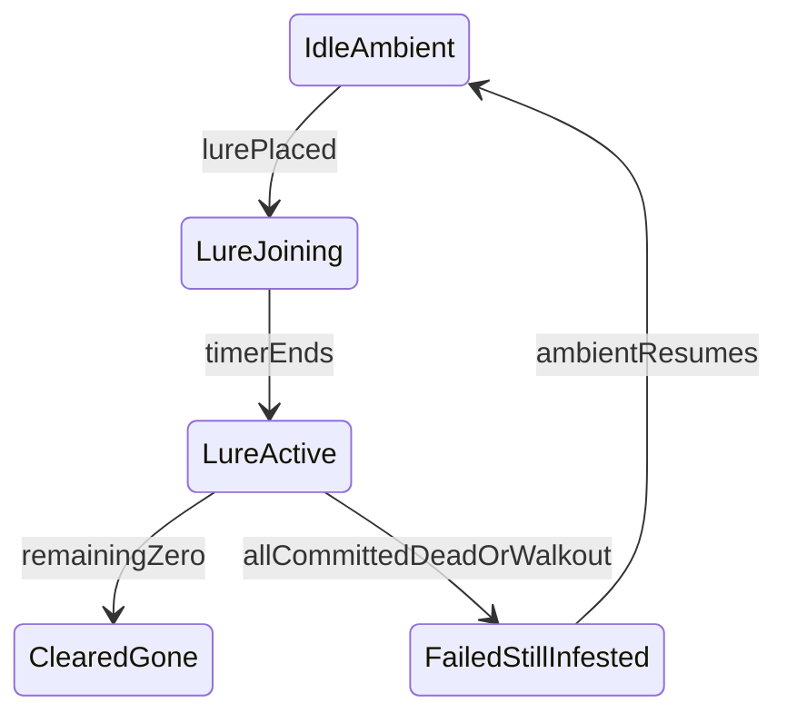

# Infestations - System Overview

Province-scale MythicMob infestations. Idle harassment around players, then a lure raid that commits you until the budget is dead or the party wipes.

See [IMPLEMENTATION_BATCHES.md](IMPLEMENTATION_BATCHES.md), [REVIEW_BATCHES.md](REVIEW_BATCHES.md), and [TEST_MATRIX.md](TEST_MATRIX.md).

## Rules (locked)

- One infestation per province. Admin add fails if that province already has one.
- **Spread:** `config.yml` `spread` is a global kill switch (default false for the test server). Worsening and neighbor infection are the same clock (`spread-interval-seconds`). When true, each idle infestation rolls `worsen-chance` to step severity up one (mild → worrying → severe → extreme, then stops) and tries to infect **one** valid land province: a direct land neighbor, or land on the far side of a **single** adjacent water or sea tile. Water/sea cannot be infested. Two-tile hops (water-water, sea-sea, water-sea) are not allowed. If both a land path and a hop exist, land wins. Hop chance is per source severity × via (`spread-chance-land` / `water` / `sea`). A group's `terrains` list in `groups.yml` (if non-empty) further limits both spread and `/infestation set` to those province terrains. Lure provinces do not spread or worsen.
- Two spawn phases, both TrialRooms-style: Mythic spawn, PDC tags, integer counters, SpawnPlanner disk, silent `remove()` (not UUID lists). Port those patterns; do not depend on TrialRooms.
- **Idle:** tagged ambient around players in the province. Caps, ring, and interval come from the **group** per severity (`groups.yml`). Spawns must land in the same province. Optional group `min-y` rejects spots below that block Y. Ambient deaths do not clear the infestation. `night-only` groups skip day (world time 13000-23000). This plugin never `remove()`s mobs (leave, lure, clear, chunk unload). Vanilla / Mythic / chunk unload may despawn them.
- **Lure:** InteractibleFurniture piece using item `ia.tfmc:lure` (not a solid block). Place only if that province is infested. One lure per province. Ambient spawning stops (existing ambient stay). Mobs spawn within config radius of the lure (default 48), paced over `lure-duration-seconds` up to `lure-count`, and also honor group `min-y`. Any `EntityDeathEvent` on a lure-tagged mob counts. Display = remaining budget (pending + alive), persisted as ints. Missing wave members (vanilla / Mythic despawn) are not counted as kills. On chunk load, lure furniture that is not in saved state is removed.
- **Join:** 20s window. Everyone in the province is warned (chat + action bar) to leave or right-click the **base block**. Right-click joins even after activate (commits). Non-joiners still in the province after activate take deserter damage and are told to leave.
- **Commit:** `PlayerProvinceLeaveEvent` is leave. A committed player leaving the province fails the lure (plugin destroys it, infestation stays). New arrivals can click to join.
- **Wipe:** if no living committed players remain (logged-out-in-grace still count as in the lure), or a committed player walks out: fail: plugin destroys the lure, infestation stays.
- **Logout:** 5 minute grace. Return in time: still committed. After grace: mark for death; on next login kill via vanilla damage so `PlayerDeathEvent` fires.
- **Lure block:** cancel furniture break/pickup unless this plugin removes it (victory, fail, admin clear, or orphan sweep). Victory: particles, destroy lure, clear infestation.
- **TextDisplay:** PDC-tagged, proximity and chunk gated like TrialRooms holograms. Lure state is Gson. On chunk load and enable: recreate if missing; delete orphan tagged displays.
- First group: `swamp_mobs` (`Swamp Monsters`), Mythic id `SwampGhoul`, night-only, `terrains: [bog]`, `min-y: 56`.
- Severity numbers live on each group. Overlay is yellow to dark red, no green. Chat and hover use group `display`.
- Spawn debug: `logging` / `wipe-log` write `logs/spawn.log`.
- Player-facing strings: no em dash. Hex via TLibs `StringFormatter`.



## Config folder layout

All paths under `plugins/Infestations/` on the server.

| Path | Purpose |
|------|---------|
| `config.yml` | Debug, lure item, join seconds, radii, grace, per-severity numbers |
| `messages.yml` | Player-facing chat, action bar, hologram lines |
| `groups.yml` | Mob groups, display names, night-only, per-severity caps / lure |
| `Data/infestations.json` | Gson: infestations and lure runtime |

## Target source tree

Packages by domain. Deserter, logout, and wipe live on `InfestationManager` (no `commit/` package).

```
infestations/
  docs/
  src/main/java/net/tfminecraft/infestations/
    Infestations.java
    command/ loader/ cache/ database/
    infestation/   # record, manager (lure, commit, wipe)
    spawn/         # SpawnPlanner port, Mythic + PDC
    lure/          # TextDisplay hologram
    map/           # infestation_data.json upload
```

## Spawn (TrialRooms)

| Concern | Approach |
|---------|----------|
| Spawn API | `MythicMob.spawn(BukkitAdapter.adapt(loc), 1)` |
| Ownership | PDC int province id + kind `ambient` or `lure` |
| Alive tracking | `int` pending + alive, not UUID sets |
| Death | `EntityDeathEvent` + PDC lookup |
| Forced despawn | none (plugin does not `remove()` mobs) |
| Positions | Shuffled disk, 3x3x3 air, 3x3 solid floor |
| UI | Real TextDisplay, proximity + chunk gated |

## Map

This plugin owns infestation state. Do not add fields to SimpleFactions `Province`. Export `infestation_data.json` and upload mode `infestation_data` via SimpleFactions `RestServer`. Overlay is yellow (mild) through dark red (extreme); uninfested provinces stay transparent.
